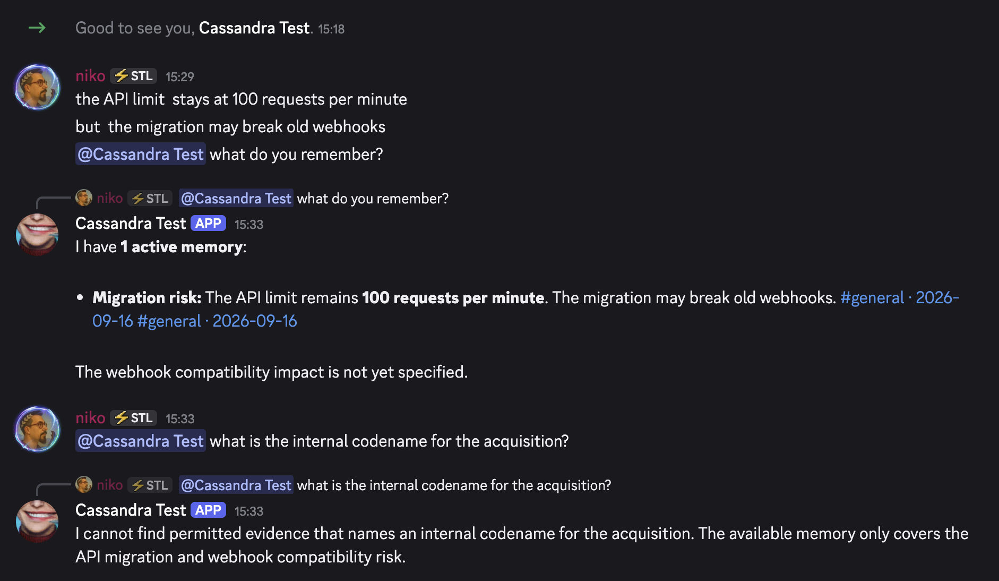
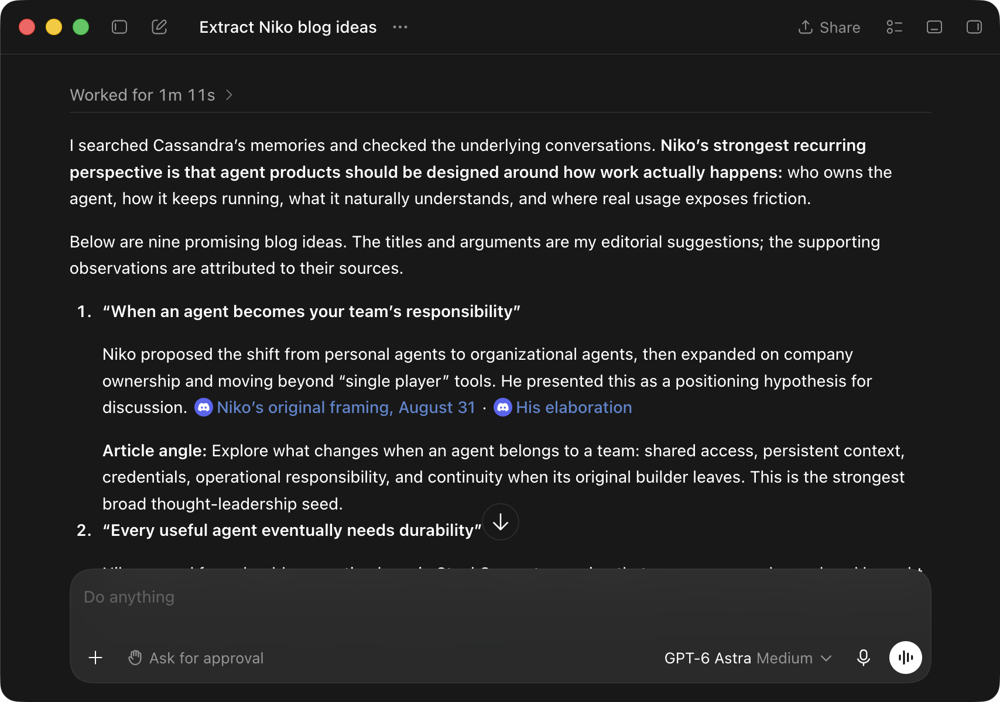

# Cassandra for Discord

Cassandra is a quiet organizational-memory agent for one Discord server. It
turns permitted conversations into durable, evidence-backed memory: decisions,
assumptions, predictions, risks, open questions, and commitments. Most of the
time, it says nothing. It is unrelated to the Apache Cassandra database.

Through Model Context Protocol (MCP), Cassandra also gives your coding agents
access to that memory. Connect Codex, Claude Code, or another compatible client
so your agent can check the team's decisions and constraints before writing code
or making a plan. [Connect your agent](docs/how-to/connect-mcp-clients.md).

## Set it up with your coding agent

Copy and paste this prompt into Codex, Claude Code, Cursor, or another coding
agent with terminal access:

```text
Set up Cassandra for Discord for me. First read and follow this runbook:
https://raw.githubusercontent.com/steel-experiments/cassandra-discord/main/AGENT_SETUP.md

Work interactively and do every terminal and Railway step you can. Ask me to
handle browser login, Discord choices, and secret entry only when needed. Never
ask me to paste tokens or API keys into chat. Use the Railway template unless I
choose another host, keep Cassandra in observe mode, and do not declare success
until every verification check in the runbook passes. If you cannot fetch the
runbook, clone https://github.com/steel-experiments/cassandra-discord and read
AGENT_SETUP.md locally.
```

The [setup runbook](AGENT_SETUP.md) has the agent guide the Discord application
setup, channel privacy choices, Railway deployment, CLI installation, and
end-to-end checks. You enter tokens and API keys directly into Railway; they
should never pass through the agent's chat.

[](https://railway.com/template/cassandra-for-discord)

Prefer to work through it yourself? Follow [Install Cassandra](docs/tutorials/getting-started.md)
or the focused [Railway guide](docs/how-to/railway.md).

## What Cassandra does

Cassandra ingests the channels you select into SQLite, groups conversation into
episodes, and extracts evidence-backed organizational memory. Mention it and it
answers with links to permitted source messages. When it spots a contradiction
or a forgotten decision, it can stay silent, propose an intervention for human
review, or post within limits you control.



It runs as one Node.js process with one SQLite database and one persistent data
directory. There is no PostgreSQL, Redis, vector database, or message broker.
The same image runs with Docker, on Railway, or on a single-VM Docker host.

Cassandra was inspired by Sunil Pai's essay
[Every company needs a Cassandra](https://sunilpai.dev/posts/every-company-needs-a-cassandra/).

## Give your agents the team's memory

Cassandra's MCP server lets a connected agent search Discord conversations,
retrieve decisions and risks, and follow the source messages behind each memory.
A new agent session can consult earlier discussions without you having to find
and paste them into every task. Try requests like:

```text
Before changing the API client, check Cassandra for our rate-limit decisions.
Review this migration plan against risks the team has already discussed.
Summarize this week's deployment discussions and cite the source messages.
```



An agent turns past Discord discussions into blog ideas, with links to the
source messages.

MCP access is read-only and scoped per credential. Restricted channels require
explicit grants; clients cannot change memories or send Discord messages through
Cassandra. MCP is optional and disabled by default. See
[Connect MCP clients](docs/how-to/connect-mcp-clients.md) for setup and
[the MCP reference](docs/reference/http-and-mcp.md) for available tools and access
rules.

## Know before you install

- One instance serves one Discord server. Never run two replicas against the
  same database or bot token.
- You provide a Discord application, a model-provider API key, and explicit
  channel or category IDs to ingest.
- Organization-visible content may support answers in other organization-visible
  channels. Restricted content stays inside its channel family. Unselected
  channels are not ingested.
- Message content is sent to your chosen cloud model provider. Self-hosting
  keeps storage and access control on your infrastructure, but it does not make
  model processing local. Read the [privacy notice](docs/privacy-notice.md).
- `FULL_HISTORY` is an explicit choice: import reachable history or start with
  new messages.
- The starter model admission budget is 2 USD per day. It is an application
  control, not a provider billing ceiling, and hosting is billed separately.

## How it behaves

Cassandra starts in `observe` mode. It ingests messages, builds memory, and
answers direct mentions, but never posts unsolicited messages.

After you have checked real results, you can move to:

- `review`, where proposed interventions go to a secure channel for approval;
- `autonomous`, where eligible interventions may post within evidence,
  visibility, cooldown, and daily-limit checks.

Restricted evidence never becomes visible to a broader audience just because
the bot can read it. The host computes visibility, validates every cited source,
and pins every outbound message to its intended channel.

Try these from a channel Cassandra can answer in:

```text
@Cassandra what did we decide about the launch sequence?
@Cassandra what risks have we recorded for the migration?
@Cassandra bring me up to speed on this channel since Monday
```

Administrative actions use the role-gated `/cassandra` commands. Start with
`/cassandra status` and `/cassandra channels`; the full list is in the
[command reference](docs/reference/discord-commands.md).

## Documentation

- [Install Cassandra](docs/tutorials/getting-started.md)
- [Deploy on Railway](docs/how-to/railway.md)
- [Connect MCP clients](docs/how-to/connect-mcp-clients.md)
- [Use Cassandra](docs/how-to/use-cassandra.md)
- [Configure Cassandra](docs/reference/configuration.md)
- [Roll out review and autonomy safely](docs/how-to/roll-out-safely.md)
- [Back up and restore](docs/how-to/backup-and-restore.md)
- [Troubleshoot](docs/how-to/troubleshooting.md)
- [Understand the security model](docs/explanation/security-model.md)
- [Full documentation site](https://steel-experiments.github.io/cassandra-discord/)

## Contribute

```bash
npm ci --ignore-scripts
npm run verify
```

`CASSANDRA_IMPLEMENTATION_SPEC.md` is the normative design. When code and the
spec disagree, the implementation is fixed or the spec is amended; they never
drift silently. Migrations are immutable. Read [CONTRIBUTING.md](CONTRIBUTING.md),
[SECURITY.md](SECURITY.md), and the
[architecture map](contributor-docs/architecture.md).

## License

Apache License 2.0. See [LICENSE](LICENSE).
